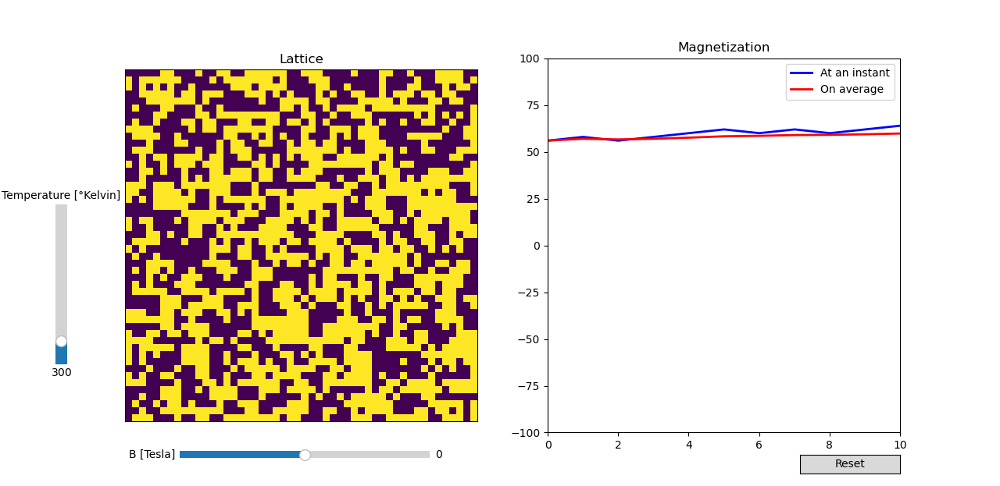

# 2D Ising Model

This repo contains a small code to simulate an Ising model on a rectangular 2D domain. You can find some explanations in the '[note\_ising](https://github.com/roomate/2D-Ising-Model/blob/master/note_ising.md)' markdown.

The command line allows you to tune out some parameters, such as the dimensions of the lattice, or the initial conditions. More specifically, the parser admits the following flags:

- `--B`. External magnetic field applied in Tesla. Default Value: 0 T.
- `--T`. Temperature of the thermal bath in kelvin. Default Value: 300K.
- `--J`. Exchange Interaction in Joule. Default Value: $4e-21$ J.
- `--bound_cond`. Boundary conditions of the domain. Default Value: "periodic".
- `--Initialization`. How to initialize the domain. Default Value: "random".
- `--cmap`. Color map to display the lattice. Default Value: "viridis".
- `--lb_T`. Temperature's lower bound of the slider. Default value: 10K.
- `--up_T`. Temperature's upper bound of the slider. Default value: 1000K.
- `--lb_B`. Manetic field's lower bound of the slider. Default value: -10T.
- `--ub_B`. Magnetic field's upper bound of the slider. Default value: 10T.

## Project structure
`ising_model.py` contains the source code to run the simulaton. Two classes are declared: `grid` and `Ising`, to define respectively the lattice hosting the spins and represtent the states and evolution law of the latter.

`note_ising.md` contains some notes I have written to briefly explain the theoretical background of the Ising model.

## Installation
To run the simulation, run in the folder of your choice:

```bash
mkdir Ising-Simulation; cd Ising-Simulation; git clone git@github.com:roomate/2D-Ising-Model.git
```
## Run the simulation
Then, to run the simulation, type the prompt:

```bash
python3 ising_model
```

followed by the potential flags desired, as described above.

You should see appear the lattice evolving in time with two sliders. One vertical to control the temperature $T$, the other horizontal to control the magnitude of the magnetic field $B$. On your right will be displayed the magnetization at time $t$ (in blue), and an average over the $10 000$ last iterations (in red).

## Example

An illustration is given below:


